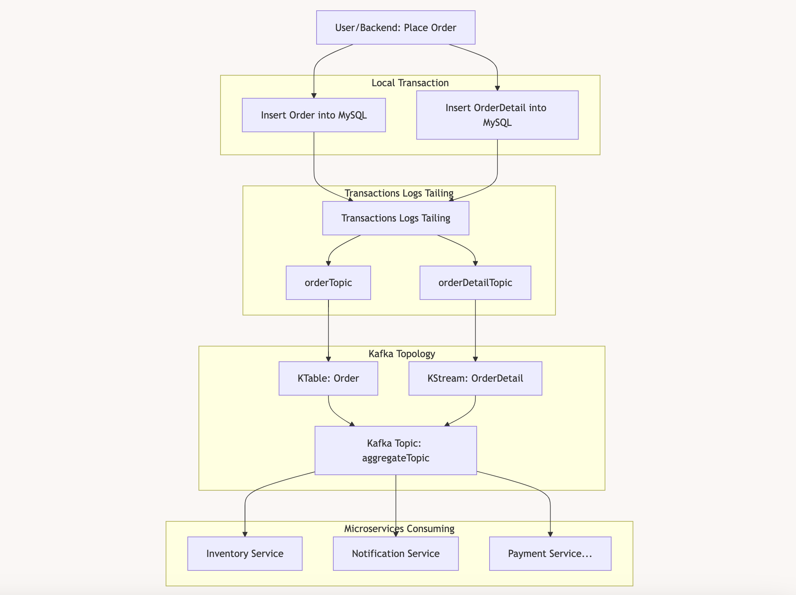

### 1. Setup
```
Ensure you installed java,maven and docker on your machine

```
### 2. Init
~~~
mvn archetype:generate -DgroupId=com.stream.transactionlog -DartifactId=transaction-log-tailing -DarchetypeArtifactId=maven-archetype-quickstart -DinteractiveMode=false
export DOCKER_HOST_IP=$(ifconfig | grep 'inet ' | grep -v 127.0.0.1 | awk '{print $2}')
docker-compose up --build -d
curl -i -X POST -H "Accept:application/json" -H  "Content-Type:application/json" http://localhost:8083/connectors/ -d @source.json
~~~
### 3. Run test
~~~
javac -d compiler -cp "lib/*" src/main/java/com/stream/transactionlog/App.java
java -cp "compiler" com.stream.transactionlog.App
mvn exec:java -Dexec.mainClass="com.stream.transactionlog.App"
~~~

### 4. Build local
~~~
mvn clean package
~~~
### 5. Build run with docker
~~~
docker build -t transaction-log-tailing .
docker run --name transaction-log-tailing-container transaction-log-tailing
docker compose up --build -d
~~~